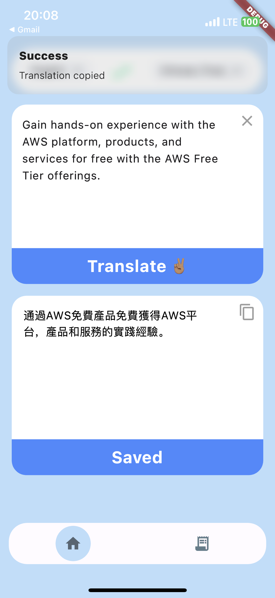
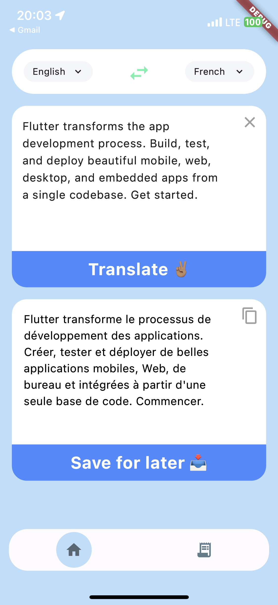
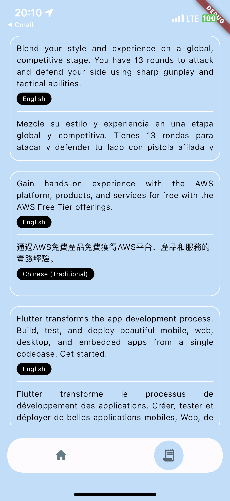

# Translator App

The Text Translator App is a mobile application built with Flutter that supports iOS and Android platforms. It leverages the RapidAPI translation APIs to provide translation services for over 100 languages. Additionally, the app allows users to save translations for later use.





## Table of Contents
- [Installation](#installation)
- [Usage](#usage)
- [License](#license)
- [Contact](#contact)

## Installation

1. Clone the repository:

```bash
git clone https://github.com/iampapagray/translator_app.git
```

2. Navigate to the project directory:

```bash
cd text-translator-app
```

3. Install the dependencies:

```bash
flutter pub get
```
4. Run the app:

```bash
flutter run
```

## Usage
- Open the app on your device or emulator.
- Enter the text you want to translate in the input field.
- Select the source and target languages from the dropdown menus.
- Tap the "Translate" button to get the translation.
- To save a translation, tap the "Save" button. The translation will be saved for later access.

## Contact
- [GitHub](https://github.com/iampapagray)
- [Fullstack Web & Mobile Dev](https://iampapagray.com)